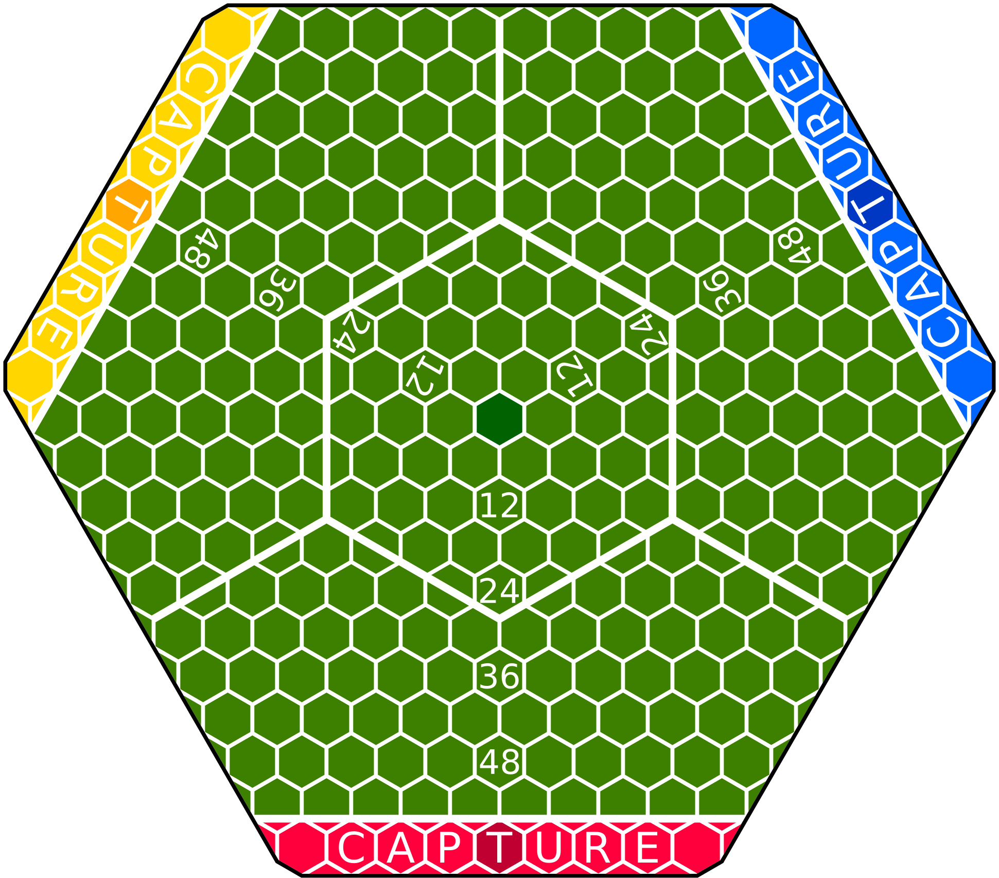

# Galaxy League &ndash; Alpha 0.2.0

A tabletop game for three players.

It is a game of capture the flag, that centres around trying to score more points than the opposing teams.

This repository is a centralised source for the most up-to-date version of the rules.

The game is played on a large hexagonal grid with spaces carved out for three teams.

You can find the rules in the [releases](https://github.com/WauSoft/GalaxyLeague/releases) section.
